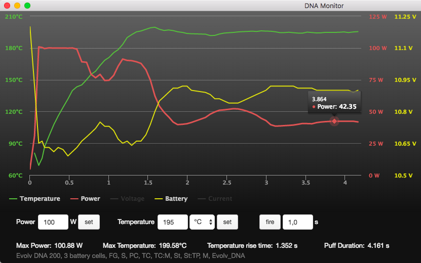

# dna-monitor

> A simple device monitoring tool for e-cigarettes with Evolv DNA chipset. Works with macOS and Linux.

This tool can't - and will never - replace the Escribe software, it's just the device-monitoring part. For configuration of preheat, profiles, wires, themes etc you still need Escribe.

### Download & Install

#### macOS

Go to the [latest release page](https://github.com/hobbyquaker/dna-monitor/releases/latest) and download the dna-monitor-X.X.X.dmg file.

#### Linux

On the [latest release page](https://github.com/hobbyquaker/dna-monitor/releases/latest) you can find a .deb file for 
Ubuntu and Debian, a .pacman file for Arch and a .tar.gz that should work on other distributions.

Don't forget to give you user access to the serial port, on Ubuntu this can be done by adding your user to the dialout group:
`sudo usermod -a -G dialout <username>` 

### Usage

Connect your DNA Device to your Mac, start the Application, vape on.

### Contributing

Clone the repo, do `npm install` in the project root. Use `npm start` to start the application in debug mode.

### Serial commands

If you want to build your own software that communicates with DNA chipsets via the serial interface this could be 
helpful: https://github.com/hobbyquaker/dna-commands

### Credits

This software uses [Highcharts](http://www.highcharts.com/) which is free only for non-commercial use.

### License

Copyright (c) Sebastian Raff <hq@ccu.io> (https://github.com/hobbyquaker)

Permission is hereby granted, free of charge, to any person obtaining a copy
of this software and associated documentation files (the "Software"), to deal
in the Software without restriction, including without limitation the rights
to use, copy, modify, merge, publish and/or distribute copies of the Software, 
and to permit persons to whom the Software is furnished to do so, subject to the 
following conditions:

The above copyright notice and this permission notice shall be included in
all copies or substantial portions of the Software.

THE SOFTWARE IS PROVIDED "AS IS", WITHOUT WARRANTY OF ANY KIND, EXPRESS OR
IMPLIED, INCLUDING BUT NOT LIMITED TO THE WARRANTIES OF MERCHANTABILITY,
FITNESS FOR A PARTICULAR PURPOSE AND NONINFRINGEMENT. IN NO EVENT SHALL THE
AUTHORS OR COPYRIGHT HOLDERS BE LIABLE FOR ANY CLAIM, DAMAGES OR OTHER
LIABILITY, WHETHER IN AN ACTION OF CONTRACT, TORT OR OTHERWISE, ARISING FROM,
OUT OF OR IN CONNECTION WITH THE SOFTWARE OR THE USE OR OTHER DEALINGS IN
THE SOFTWARE. 
